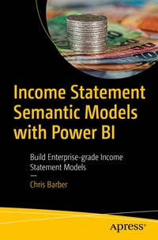

# Apress Source Code

This repository accompanies [*Income Statement Semantic Models*](https://www.link.springer.com/book/10.1007/979-8-8688-0330-7) by Chris Barber (Apress, 2024).

[comment]: #cover

Download the files as a zip using the green button, or clone the repository to your machine using Git.

Additional source files can be found here: https://drive.google.com/drive/folders/1FDRVokSVvQ0mjTUzHiPOuO7twceCgu9w?usp=sharing

## Releases

Release v1.0 corresponds to the code in the published book, without corrections or updates.

## Contributions

See the file Contributing.md for more information on how you can contribute to this repository.
